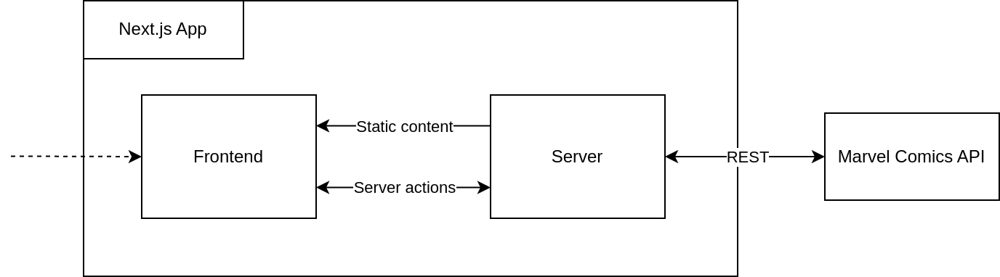
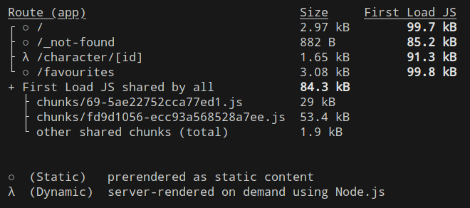

# Marvel Web Catalog using Next.js App Router + Server Components/Actions 🦸

## Table of Contents
- [Overview](#overview)
- [Features](#features)
  - [Catalog Page](#catalog-page)
  - [Favorites Page](#favorites-page)
  - [Character Details Page](#character-details-page)
- [Architecture](#architecture)
- [Rendering Strategy](#rendering-strategy)
- [Getting Started](#getting-started)
  - [Prerequisites](#prerequisites)
  - [Production Mode](#production-mode)
  - [Development Mode](#development-mode)
- [License](#license)

## Overview 🌐

This web application showcases a catalog of Marvel characters by consuming the Marvel API. It features functionality for storing favorite characters using the Context API and offers a name-based filter for ease of search.

## Features 🌟

### Catalog Page 📖

- Displays a catalog of up to 50 Marvel characters.
- Supports searching characters by name.
- Enables storing and managing favorite characters through the Context API.
- Leverages the Marvel API for fetching character data.

### Favorites Page ❤️

- Lists characters marked as favorites.
- Supports local search, displaying only favorite characters matching the search query.

### Character Details Page 🔍

- Presents character name, description, and a chronological list of comic appearances.
- Allows marking/unmarking characters as favorites.

## Architecture 🏗️

Built with TypeScript, React, and Next.js, the app utilizes SSR, Server Components, and Server Actions for server interaction, eliminating the need for a separate API while ensuring end-to-end typing. Styling is achieved with Tailwind CSS, enhanced by custom classes for color schemes, character card details, and a custom-styled scroll bar.

Data from the Marvel API is validated using Zod schemas to ensure the expected data structure.

## Rendering Strategy 🎨

- The homepage and favorites page are pre-rendered during production build, ensuring fast initial loads with dynamic behavior handled client-side.
- Character detail pages employ Static Site Generation (SSG), serving static content that is generated and cached at runtime, ensuring efficiency and speed.

## Getting Started 🚀

### Prerequisites

- Copy `.env.example` to `.env` and fill in your Marvel API keys. Obtain keys at [Marvel's Developer Portal](https://developer.marvel.com/documentation/getting_started).
- Install dependencies with `npm i`.

### Production Mode

- Build the application with `npm run build`.
- Launch the production version with `npm run start`.

### Development Mode

- Start the development server with `npm run dev` for hot-reloading and dynamic page behavior.

## License 📝

This project is licensed under the GNU General Public License (GPL). For more information, see the `LICENSE` file in this repository.
